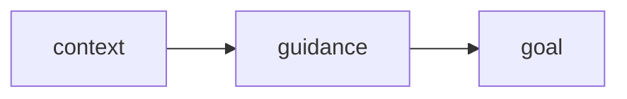

# Summary of the Three Frameworks: CRAFT, CO-STAR, CRISPE

## Intro

These three frameworks are popular, easy-to-remember checklists that can help people write clearer, more effective prompts by breaking them into key components. They overlap significantly and all emphasize giving the model a role, clear instructions, context, audience awareness, and output guidance. Each has a slightly different flavor and emphasis.

Overall though, they represent a process that provides the LLM wit:.

## Frameworks

Leveraging these frameworks doesn't have to be overly prescriptive and a user should feel free to combine elements from more than one depending on the task.  All three remain relevant in 2026. They are essentially different ways of organizing the same core best practices rather than competing methodologies.

**CRAFT** (Character, Request, Assets, Focus, Tune) is a practical, marketer-oriented framework. It treats prompting as a collaborative process: you assign the AI a specific role (**Character**), state the task (**Request**), supply relevant background materials or examples (**Assets**), define who the output is for (**Focus**), and set the desired tone or make the interaction iterative by having the AI ask clarifying questions (**Tune**). It’s especially useful for content workflows where you want to ground the AI with real documents and refine through conversation.

**CO-STAR** (Context, Objective, Style, Tone, Audience, Response) is one of the most structured and widely adopted frameworks. It was popularized by data scientist Sheila Teo after she won Singapore’s first GPT-4 Prompt Engineering competition. It excels at producing consistent, professional-grade output by clearly separating background information, the exact goal, writing style, emotional tone, target audience, and desired output format (e.g., JSON or bullet points). It’s particularly strong for business, customer service, or production use cases where precision and structure matter.

**CRISPE** (Capacity/Role, Insight, Statement, Personality, Experiment) balances clear structure with creative exploration. You define the AI’s role and expertise level, provide relevant background (**Insight**), state the core task, set the desired tone/personality, and explicitly ask for multiple versions or variations (**Experiment**). It’s well-suited for ideation, creative tasks, or situations where you want options to choose from or iterate on.

**Comparison Table**

| Aspect                  | CRAFT                                      | CO-STAR                                          | CRISPE                                          |
|-------------------------|--------------------------------------------|--------------------------------------------------|-------------------------------------------------|
| **Core Components**    | Character, Request, Assets, Focus, Tune   | Context, Objective, Style, Tone, Audience, Response | Capacity/Role, Insight, Statement, Personality, Experiment |
| **Best Suited For**    | Content creation, marketing workflows, iterative refinement | Professional/business writing, structured or production outputs | Creative ideation, brainstorming, generating multiple options |
| **Key Strength**       | Strong emphasis on providing real assets + turning prompting into a back-and-forth conversation | Excellent separation of style vs. tone + explicit response format for consistency | Built-in "Experiment" step that encourages generating variations |
| **Unique Flavor**      | Most conversational/collaborative          | Most structured and "full-stack" for professional use | Most exploration-oriented                       |
| **Overlap with Others**| High — covers role, task, context, audience, tone | High — covers nearly all the same elements with different grouping | High — role + context + task + tone + iteration |
| **When to Choose It**  | When you have documents/examples to share or want the AI to ask questions | When you need polished, consistent output in a specific format | When you want several creative options to pick from |

**Reference URLs**

**CRAFT**  
- Primary source: [The CRAFT Framework: Practical AI Prompting for Marketers](https://www.linkedin.com/pulse/craft-framework-practical-ai-prompting-marketers-tris-hussey-cm-sampc) (Tris Hussey)

**CO-STAR**  
- Original popularization: [How I Won Singapore’s GPT-4 Prompt Engineering Competition](https://towardsdatascience.com/how-i-won-singapores-gpt-4-prompt-engineering-competition-34c195a93d41) (Sheila Teo)  
- Clear breakdown: [COSTAR Prompt Engineering: What It Is and Why It Matters](https://portkey.ai/blog/what-is-costar-prompt-engineering)

**CRISPE**  
- Primary source: [CRISPE — ChatGPT Prompt Engineering Framework](https://sourcingdenis.medium.com/crispe-prompt-engineering-framework-e47eaaf83611) (Denys Dinkevych)
